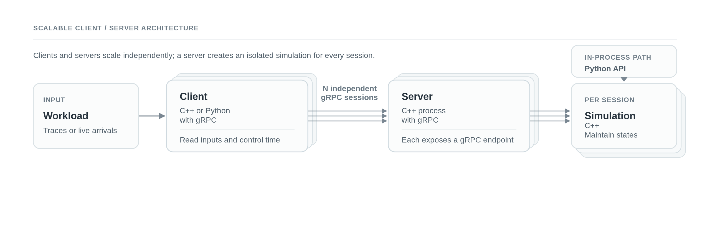
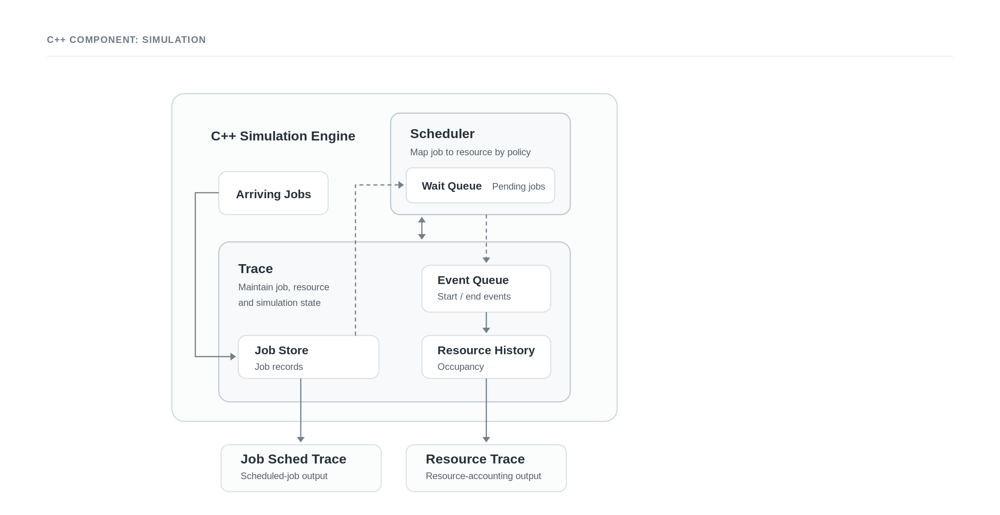

# Discrete Resource Event Modeling and Multi-cluster Scheduling Simulator

[](https://dr-evt.readthedocs.io/en/latest/?badge=latest)
[](https://github.com/LLNL/dr_evt/blob/main/LICENSE)

DR_EVT is a high-performance HPC job scheduler simulator supporting EASY and
CONSERVATIVE backfilling algorithms. **Uniquely supports online simulation via
gRPC**, enabling coordinated multi-cluster simulations where distributed schedulers
interact in real-time.

**[📚 Read the Full Documentation on ReadTheDocs →](https://dr-evt.readthedocs.io/)**

### Distributed gRPC deployment

Clients and digital-twin controllers can open independent gRPC sessions to any
number of server processes. Each server creates an isolated simulation for
every session; neither the number of clients nor the number of servers is
fixed. A server can handle multiple concurrent sessions.
Simulation` is the shared scheduling core. C++ and Python use it directly;
the gRPC server hosts the same core remotely.
Containerization option is offered for the remote client/server deployment.
MPI can optionally serve as a coordination harness for gRPC client/server testing.



### Simulation internals

Each C++ `Simulation` owns a `Trace` and a `Scheduler`. `Trace` retains the
job store, running-job event queue, and resource history, while the scheduler
retains its wait queue. The simulation coordinates them and writes the job and
resource traces.

<p align="center">
  
</p>

## Features

### Core Simulation
- **Priority Policies**: FCFS, SJF, LJF with multiple wait-queue implementations
- **Backfilling Algorithms**: EASY and CONSERVATIVE backfilling (fully implemented)
  - EASY: O(n) complexity, optimizes utilization (~95%)
  - CONSERVATIVE: O(n²) complexity, guarantees fairness to all waiting jobs
  - Both verified against independent Python reference implementations
- **Wait Queue Implementations**: Circular buffer (default), deque, multimap, block-based (7 sizes: 4-256)
- **Replay and Simulation Modes**: Replay historical traces or simulate with run time distributions
- **Various Simulated Job Duration Options**: Use `actual_run_time`, `time_limit`, or a configurable sampled distribution
- **Python Reference Implementation**: Independent Python EASY-backfilling scheduler used for differential validation and expected-output generation

### APIs & Integration
- **Streaming API**: Online simulation with dynamic job arrival (`append_job`, `advance_to`, `run_until_exclusive`)
- **gRPC Service**: Network-exposed streaming API enabling:
  - **Multi-cluster coordination**: Distributed schedulers interact in real-time
  - Remote simulation control from any gRPC-capable language
  - MPI-based multi-client/multi-server test harness for coordinated simulations
- **Python Bindings**: Full Python API for in-process simulation control
- **Protocol Buffer Configuration**: Structured configuration files for complex simulations

### Testing & Validation
- **Comprehensive Test Suite**: 114 tests (114/114 passing as of 2026-09-07)
  - 34 comprehensive tests (EASY backfilling correctness)
  - 7 unit tests (I/O and format validation)
  - 6 feature tests (policy comparisons)
  - 2 conservative tests (CONSERVATIVE vs EASY behavioral differences)
  - 7 scale tests (10-2000 jobs)
  - 4 replay tests (determinism verification)
  - 5 resource-history and 6 job-store tests
  - 18 append-job/backfill-window tests and 14 progressive-loading tests
  - 9 protobuf configuration tests and 2 dedicated power-usage CTest tests
- **Dual Validation**: C++ verified against independent Python reference implementations
  - EASY: scripts/python_reference_scheduler.py
  - CONSERVATIVE: scripts/python_conservative_scheduler.py
  - 0 mismatches on all test traces
- **Differential Testing**: Compare multiple queue implementations (circular/deque/multimap/block)
- **CI/CD Integration**: Automated testing on every commit via GitHub Actions

## Documentation

**Primary Documentation**: [**ReadTheDocs** (https://dr-evt.readthedocs.io/)](https://dr-evt.readthedocs.io/)
- Searchable, versioned documentation with PDF/EPUB downloads
- Automatic builds from `main` branch
- Mobile-friendly with navigation

### Quick Reference (GitHub)
For quick access without leaving GitHub:
- **[Complete Documentation Index](docs/)** - All guides, references, and specifications
- **[Scheduling Policies](docs/BACKFILLING_ALGORITHMS.md)** - Priority policies plus EASY and CONSERVATIVE backfilling
- **[Streaming API](docs/api/STREAMING_API.md)** - Online simulation API
- **[Client/Server (gRPC)](docs/CLIENT_SERVER_GUIDE.md)** - Remote simulation over network
- **[Python API](docs/api/PYTHON_API.md)** - Python bindings and reference implementation
- **[CLI Options](docs/user-guide/command-line.md)** - Command-line reference
- **[Prototext Configuration](docs/user-guide/protobuf-config.md)** - Structured `.textproto` simulation configuration
- **[Testing Guide](docs/TESTING_GUIDE.md)** - How to select, run, and interpret tests; verification methodology
- **[Test Suite Inventory](tests/README.md)** - Test scripts, fixtures, expected outputs, and directory-level details
- **[Scheduler Correctness Tests](tests/test_traces/scheduler_correctness/README.md)** - 34 fixtures organized by complexity
- **[Scripts Guide](scripts/README.md)** - Testing and verification scripts

**Note:** Local builds are optional for contributors. The official documentation is automatically built and published to ReadTheDocs on every commit to `main`.


### Building Documentation Locally

Build the same Sphinx documentation that powers ReadTheDocs:

```bash
cd docs
python3 -m venv venv_docs
source venv_docs/bin/activate
pip install -r requirements.txt
make html
```

The HTML site is written to `docs/_build/html/index.html`. If `doxygen` is
available on `PATH`, `make html` runs it first and populates the generated C++
API Reference pages. Without Doxygen, the rest of the documentation still
builds, but generated C++ declarations are omitted.


## Requirements

### Required
 + **Platforms**: Linux-based systems (macOS may work but not officially supported)
 + **C++ compiler**: C++17 support (GCC 7+, Clang 5+, or newer)
 + **CMake**: 3.24 or later
 + **Boost**: Components required: `regex`, `filesystem`, `system`, `program_options`, `serialization`, `container`, `multi_index`, `circular_buffer`
   - Tested with Boost 1.70+
   - Install: `apt-get install libboost-all-dev` (Ubuntu/Debian) or `brew install boost` (macOS)

### Optional (for full features)

**[Protocol Buffers](https://developers.google.com/protocol-buffers)**: For
Prototext configuration files passed with `--config`
(`-DDR_EVT_ENABLE_PROTOBUF=ON`)
- Lets a simulation configuration file replace a long set of CLI options
- Auto-downloaded if not found, or use `-DPROTOBUF_ROOT=<path>`

**Python 3.7+**: For Python bindings (`-DDR_EVT_BUILD_PYTHON=ON`)
- Python development headers required: `apt-get install python3-dev`
- pybind11 auto-downloaded via FetchContent if not found

**[gRPC](https://grpc.io/)**: For the client/server simulation service
(`-DDR_EVT_ENABLE_GRPC=ON`)
- **Auto-download**: If not found, gRPC (with bundled Protobuf) is auto-downloaded via FetchContent (~5-10 min first build). Can OOM under full parallelism on memory-constrained machines - see "Livermore Computing (LC) HPC systems" below.
- **Manual install**: `apt-get install libgrpc++-dev protobuf-compiler-grpc` (Ubuntu/Debian)
- **Important**: gRPC includes its own Protobuf. If gRPC is enabled, you don't need separate Protobuf install.

**MPI**: For multi-client/server test harness only (optional even with gRPC)
- Install: `apt-get install libopenmpi-dev openmpi-bin`
- Install the Python MPI binding for the launcher: `python3 -m pip install mpi4py`

### Protocol Buffers & gRPC Details

Both features are disabled by default in a plain build:

- `DR_EVT_ENABLE_PROTOBUF=OFF`
- `DR_EVT_ENABLE_GRPC=OFF`

**Protocol Buffers / Prototext:** Enable with
`-DDR_EVT_ENABLE_PROTOBUF=ON` to use a Protocol Buffer text-format
configuration file with `--config` instead of supplying the corresponding
simulation settings as individual CLI options. If gRPC is not enabled,
standalone Protobuf is found on the system or fetched with CMake
FetchContent.

**gRPC:** Enable with `-DDR_EVT_ENABLE_GRPC=ON` to build the `dr_evt_server`
and `dr_evt_client` programs for remote client/server simulation control.
gRPC automatically enables Protobuf because the service messages are defined
in `.proto` files. The gRPC dependency path supplies a compatible Protobuf, so
no separate Protobuf installation is needed for a gRPC build.

**Key relationship:**
```
plain build                  → Protobuf OFF, gRPC OFF
Prototext configuration build → Protobuf ON, gRPC OFF
client/server build          → gRPC ON, Protobuf enabled automatically
```

### CMake Configuration Options

**Boost:**
```bash
cmake .. -Wno-author -Wno-dev -DBOOST_ROOT=/path/to/boost
# or search one or more dependency prefixes
cmake .. -Wno-author -Wno-dev -DCMAKE_PREFIX_PATH=/path/to/dependencies
# or use environment variable
export BOOST_ROOT=/path/to/boost

# Skip system paths (useful if system install is broken or mismatched by version)
cmake .. -Wno-author -Wno-dev -DAVOID_SYSTEM_BOOST=ON
```

`CMAKE_PREFIX_PATH` remains active with `AVOID_SYSTEM_BOOST=ON`; only default
system locations are excluded.

**Protobuf (standalone, when gRPC not used):**
```bash
cmake .. -Wno-author -Wno-dev -DPROTOBUF_ROOT=/path/to/protobuf

# Skip system paths (useful if system install is broken or mismatched by version)
cmake .. -Wno-author -Wno-dev -DDR_EVT_ENABLE_PROTOBUF=ON -DAVOID_SYSTEM_PROTOBUF=ON
```

**gRPC:**
```bash
# Enable gRPC support (auto-enables Protobuf)
cmake .. -Wno-author -Wno-dev -DDR_EVT_ENABLE_GRPC=ON

# Skip system path search (useful if system install is broken or mismatched by version)
cmake .. -Wno-author -Wno-dev -DDR_EVT_ENABLE_GRPC=ON -DAVOID_SYSTEM_GRPC=ON

```
`-DAVOID_SYSTEM_GRPC=ON` skips default system prefixes, but still accepts an
explicit `gRPC_DIR`, `CMAKE_PREFIX_PATH`, or a non-system
`CMAKE_INSTALL_PREFIX`. If none contains a complete gRPC package, CMake uses
FetchContent. See the OOM note under "Livermore Computing (LC) HPC systems"
below.

**Python bindings:**
```bash
cmake .. -Wno-author -Wno-dev -DDR_EVT_BUILD_PYTHON=ON

# Specify Python interpreter (useful with virtual environments)
cmake .. -Wno-author -Wno-dev -DDR_EVT_BUILD_PYTHON=ON -DPython3_EXECUTABLE=/path/to/python3
```

**Cross-compilation (Protobuf):**
```bash
cmake .. -Wno-author -Wno-dev \
  -DProtobuf_PROTOC_EXECUTABLE=/host/bin/protoc \
  -DPROTOBUF_DIR=/target/protobuf
```

**Livermore Computing (LC) HPC systems:**
```bash
mkdir build && cd build
cmake .. \
  -DDR_EVT_ENABLE_GRPC=ON \
  -DDR_EVT_BUILD_PYTHON=ON \
  -DAVOID_SYSTEM_GRPC=ON \
  -DAVOID_SYSTEM_BOOST=ON \
  -DCMAKE_INSTALL_PREFIX=$(realpath ../install)
make -j4
make install

# Set up environment
export CMAKE_INSTALL_PREFIX=$(realpath ../install)
export DR_EVT_INSTALL_LIBDIR=lib  # Use the configured CMAKE_INSTALL_LIBDIR value (often lib64 on HPC systems)
export PATH=${CMAKE_INSTALL_PREFIX}/bin:$PATH
export PYTHONPATH=${CMAKE_INSTALL_PREFIX}/${DR_EVT_INSTALL_LIBDIR}/python:$PYTHONPATH
```

The `AVOID_SYSTEM_*` options prevent ABI mismatches with system-installed
libraries (common on HPC systems with multiple compiler toolchains). They
still permit dependencies in explicit/local prefixes; dependencies not found
there are built via FetchContent. A from-source gRPC build can OOM on
memory-constrained nodes under full parallelism, with output like:

```
make[2]: *** [.../boringssl_gtest.dir/build.make:90: .../gtest-all.cc.o] Killed
make[1]: *** [CMakeFiles/Makefile2:12579: .../boringssl_gtest.dir/all] Error 2
```

`Killed` means memory pressure, not a compiler error. `-j4` above is deliberately conservative for this reason (~2 GB/job is a reasonable estimate for gRPC); lower it further if you still hit this.
When using pre-built gRPC, `make -j$(nproc)` should still be ok.

## Quick Start

### Build from Source

```bash
# Clone repository
git clone https://github.com/llnl/dr_evt.git
cd dr_evt

# Create build directory
mkdir build && cd build

# Configure
cmake -DBOOST_ROOT=/path/to/boost \
      -DCMAKE_INSTALL_PREFIX=/install/path \
      ..

# Build and install
make -j4
make install
```

### Run Your First Simulation

After installation, the binaries are in `${CMAKE_INSTALL_PREFIX}/bin`:

**Quick test:**
```bash
cd ${CMAKE_INSTALL_PREFIX}/bin

# Run a simple test
./simulator /path/to/dr_evt/tests/test_traces/unit/simple.csv

# Run with EASY backfilling (default)
./simulator trace.csv --priority_policy fcfs --backfill_policy easy

# Run with custom parameters
./simulator trace.csv \
    --priority_policy fcfs \
    --backfill_policy easy \
    --total_nodes 100 \
    --outfile results.csv
```

**Using Protocol Buffer configuration files:**

Create a configuration file `sim_config.textproto`:
```protobuf
simulation_params {
  infile: "trace.csv"
  outfile: "results.csv"
  resource_trace: "resources.csv"

  # System configuration
  total_nodes: 1000
  seed: 42

  # Scheduling policies
  backfill_policy: "easy"     # "easy", "conservative", or "none"
  priority_policy: "fcfs"     # "fcfs", "sjf", or "ljf"

  # Trace format
  trace_format: "simple"      # "simple" or "lassen"
  timestamp_format: "epoch"   # "epoch" or "iso"

  # Simulation limits
  max_jobs: 10000

  # Run time simulation (optional)
  run_time_mode: "actual"     # "actual" (default), "distribution", or "limit"
  run_time_scale: 1.0

  # Output options
  verbose: false
}
```

Run with configuration file:
```bash
# Use protobuf config (overrides command-line defaults)
${CMAKE_INSTALL_PREFIX}/bin/simulator --config sim_config.textproto trace.csv

# Command-line options override config file values
${CMAKE_INSTALL_PREFIX}/bin/simulator --config sim_config.textproto \
    --total_nodes 2000 \
    --verbose \
    trace.csv
```

**Configuration precedence:**
1. Command-line options (highest priority)
2. Protocol Buffer config file (`--config`)
3. Built-in defaults (lowest priority)

### Simulation Modes

DR_EVT supports two top-level modes for processing job traces: **Simulation
Mode**, where the scheduler makes real decisions, and **Replay Mode**, where
the scheduler is bypassed.

#### Simulation Mode

**Purpose:** Simulate scheduling decisions with realistic scheduler knowledge

**Input:** Trace with job submissions and time limits
- Requires: `submit_time`, `time_limit`, job size
- Scheduler plans based on time limits as the estimation of job duration (realistic but limited)
- Each job's actual duration is then determined by `--run_time_mode`:
  - `actual` (default): use the trace's real duration (accepted columns:
    `actual_run_time`, `duration`, `actual_duration`, `run_time`)
  - `distribution`: sample from a statistical distribution
  - `limit`: job runs exactly to its `time_limit` (no early completion —
    an upper bound on scheduler performance, since the scheduler's estimate
    is never wrong)

**Use cases:**
- Standard HPC scheduling simulation; compare scheduling policies
- What-if analysis: "What if we changed the backfill policy?"
- Capacity planning: "Can we handle 20% more jobs?"
- Theoretical best-case performance analysis (`limit`, since the scheduler's
  plan always matches reality)

**Examples:**
```bash
# Use the trace's own actual, historical run times (default)
${CMAKE_INSTALL_PREFIX}/bin/simulator trace.csv \
    --run_time_mode actual \
    --backfill_policy easy

# Realistic variation (80% of time_limit ± 10%)
${CMAKE_INSTALL_PREFIX}/bin/simulator trace.csv \
    --run_time_mode distribution \
    --run_time_distribution normal \
    --run_time_scale 0.8 \
    --run_time_stddev 0.1

# Upper bound: jobs run exactly their time_limit
${CMAKE_INSTALL_PREFIX}/bin/simulator trace.csv \
    --run_time_mode limit
```

#### Replay Mode

**Purpose:** Reproduce a known execution's resource usage from historical or
pre-computed job times, with no scheduler involved

**Tool:** `tracer` (installed as `${CMAKE_INSTALL_PREFIX}/bin/tracer`) - a
separate binary from `simulator`, with no scheduler code linked in at all.
Feeding a `begin_time`/`end_time` file into `simulator` instead does **not**
bypass its scheduler - `simulator` always calls into the same FCFS/backfill
logic and computes its own start times, discarding any recorded `begin_time`.
Only `tracer` honors the file's own times directly.

**Input:** Trace with pre-computed schedule
- Requires: `num_nodes`, `begin_time`, `end_time`, `job_submit_time`, and
  `time_limit`. `q_id` is optional and defaults to `1` (`Queue1`) when
  omitted. Legacy `queue` input requires configuring with
  `-DDR_EVT_LEGACY_QUEUE_INPUT=ON`.
  `job_submit_time` isn't used
  to decide when a job runs (that's `begin_time`), but it drives a per-job
  "nodes busy at submission" stat for downstream analysis/visualization, and
  there's no shorter format that omits it.
- No scheduler is consulted - `begin_time`/`end_time` are used as-is
- Can replay simulation output or historical HPC logs

**Use cases:**
- Generate resource usage traces from historical schedules
- Validate resource accounting correctness
- Reproduce execution for debugging/visualization
- Analyze utilization of past system behavior

**Example:**
```bash
# Step 1: Run simulation
${CMAKE_INSTALL_PREFIX}/bin/simulator input.csv \
    --total_nodes 100 --outfile schedule.csv --resource_trace sim.csv

# Step 2: Replay the schedule with tracer - no scheduler-related flags exist for it
${CMAKE_INSTALL_PREFIX}/bin/tracer --infile schedule.csv \
    --total_nodes 100 --resource_trace replay.csv \
    --outfile tracer_out.csv --subfile tracer_sub.csv --subsumf tracer_subsum.csv

# Step 3: Verify (should be identical)
diff sim.csv replay.csv
```

**Key difference:**
- **Simulation Mode** (`simulator`): the scheduler makes real decisions as
  jobs are submitted; `--run_time_mode` controls how each job's actual
  duration is determined
- **Replay** (`tracer`): no scheduler is linked in; a previously computed
  schedule (`begin_time`/`end_time`) is read directly and run straight
  through resource accounting

**When to use which:**
| Scenario | Mode | Why |
|----------|------|-----|
| Test scheduler or policy changes | Simulation | Scheduler must make real decisions to see the effect |
| Capacity planning | Simulation | Need the scheduler in the loop under hypothetical load |
| Reproduce a specific historical schedule | Replay | Bypasses the scheduler; replays known begin/end times exactly |
| Validate resource-accounting correctness | Replay | Compare against a known-correct trace |

### Verify Installation

```bash
# Run scheduler-correctness suite (34 fixtures)
./tests/run_scheduler_correctness_tests.sh

# Run quick unit tests
./tests/run_unit_tests.sh
```

### Build Options

**Enable OpenMP for parallel execution:**
```bash
cmake -DDR_EVT_WITH_OPENMP=ON \
      -DBOOST_ROOT=/path/to/boost \
      ..
```

Then control parallelism with environment variables:
```bash
export OMP_NUM_THREADS=4
export OMP_PROC_BIND=close
${CMAKE_INSTALL_PREFIX}/bin/simulator trace.csv
```

**Enable gRPC client/server (optional):**
```bash
cmake -DDR_EVT_ENABLE_GRPC=ON \
      -DBOOST_ROOT=/path/to/boost \
      ..
make -j4
make dr_evt_server-bin dr_evt_client-bin
```

**Cross-compilation:**
```bash
cmake -DProtobuf_PROTOC_EXECUTABLE=/host/bin/protoc \
      -DPROTOBUF_DIR=/target/protobuf \
      -DBOOST_ROOT=/path/to/boost \
      ..
```

### gRPC Client/Server Mode (Optional)

DR_EVT runs as a network service, enabling **coordinated multi-cluster simulations**
in a distributed fashion and digital-twin scheduler interacting in real-time, as well as remote simulation
control from any gRPC-capable language.

**Start the server:**
```bash
${CMAKE_INSTALL_PREFIX}/bin/dr_evt_server --port 50051
```

**Run a client:**
```bash
# Basic usage
${CMAKE_INSTALL_PREFIX}/bin/dr_evt_client --server localhost:50051 \
    --trace trace.csv \
    --total_nodes 1000

# With custom parameters
${CMAKE_INSTALL_PREFIX}/bin/dr_evt_client --server localhost:50051 \
    --trace trace.csv \
    --total_nodes 1000 \
    --backfill_policy conservative \
    --priority_policy fcfs \
    --outfile results.csv
```

**Use cases:**
- **Multi-cluster coordination**: Simulate distributed schedulers coordinating across clusters
- **Remote simulation**: Run simulator on HPC cluster, control from laptop
- **Multi-language integration**: Use Python/Java/Go clients with C++ simulator
- **Distributed testing**: Multiple clients testing different scenarios simultaneously
- **Web dashboards**: Real-time simulation monitoring over HTTP/gRPC

**Architecture:**
```
┌─────────────┐                  ┌──────────────┐
│   Client    │  gRPC Stream     │    Server    │
│ (Any Lang)  │ ←──────────────→ │  (C++ Core)  │
└─────────────┘                  └──────────────┘
     │                                   │
     │ append_job()                      │ Simulation
     │ advance_to()                      │ Instance
     │ get_statistics()                  │
     └───────────────────────────────────┘
```

See [Client/Server Guide](docs/CLIENT_SERVER_GUIDE.md) for details.

### Containers

Docker client/server files are organized under
[`containers/docker/`](containers/docker/README.md). The server bind-mounts a
host result directory at `/data`, while the interactive client shell
bind-mounts a host input-data directory there.

Rootless Podman files are in [`containers/podman/`](containers/podman/README.md).
They do not need `sudo`; `--userns=keep-id` preserves your host UID/GID for
bind-mounted files. Confirm rootless operation first:

```bash
podman info --format '{{.Host.Security.Rootless}}'
```

From the repository root, build and start the rootless Podman setup:

```bash
mkdir -p results data
podman build -f containers/podman/server/Containerfile -t dr-evt-server:local .
podman build -f containers/podman/client/Containerfile -t dr-evt-client:local .
podman network exists dr-evt-net || podman network create dr-evt-net

podman run --detach --rm --name dr-evt-server \
  --network dr-evt-net --userns=keep-id --publish 50051:50051 \
  --volume "$PWD/results:/data" dr-evt-server:local

podman run --interactive --tty --rm \
  --network dr-evt-net --userns=keep-id \
  --volume "$PWD/data:/data" dr-evt-client:local
```

Inside the client shell, invoke:

```bash
/opt/dr-evt/bin/dr_evt_client dr-evt-server:50051 /data/my-trace.csv
```

Use `:Z` on bind mounts on SELinux-enforcing hosts, such as
`--volume "$PWD/results:/data:Z"`. Stop the server with
`podman stop dr-evt-server`.


## Authors:
  Many thanks go to DR_EVT's [contributors](https://github.com/llnl/dr_evt/graphs/contributors).

## Release:
 DR_EVT is distributed under the terms of the MIT license.
 All new contributions must be made under this license.
 See [LICENSE](https://github.com/llnl/wcs/blob/master/LICENSE) and [NOTICE](https://github.com/llnl/wcs/blob/master/NOTICE) for details.

 + `SPDX-License-Identifier: MIT`
 + `LLNL-CODE-844050`

## Contributing:
 Please submit any bugfixes or feature improvements as [pull requests](https://help.github.com/en/github/collaborating-with-issues-and-pull-requests/creating-a-pull-request-from-a-fork).
