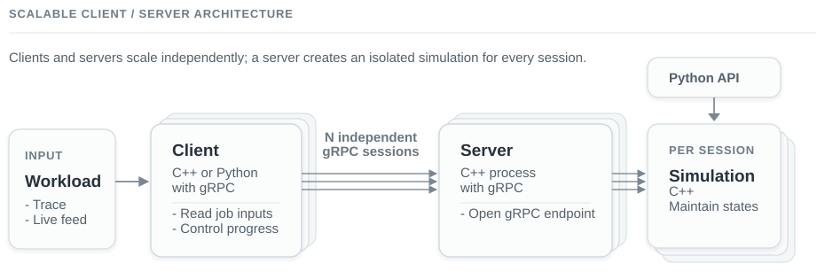

# Discrete Resource Event Modeling and Multi-cluster Scheduling Simulator

[](https://dr-evt.readthedocs.io/en/latest/?badge=latest)
[](https://github.com/LLNL/dr_evt/blob/main/LICENSE)

DR_EVT is a high-performance HPC job scheduler simulator supporting EASY and
CONSERVATIVE backfilling algorithms. **Uniquely supports online simulation via
gRPC**, enabling [coordinated multi-cluster simulations](https://dr-evt.readthedocs.io/en/latest/user-guide/client-server-use-cases.html)
where distributed schedulers interact in real-time.
Another use case is the [Fugaku Power-Usage Simulation Experiment](https://dr-evt.readthedocs.io/en/latest/user-guide/fugaku-power-experiment.html).

**[📚 Read the Full Documentation on ReadTheDocs →](https://dr-evt.readthedocs.io/)**

## Features

### Scheduling and traces

- **Scheduling:** FCFS, SJF, and LJF priority policies with EASY,
  conservative, or no backfilling.
- **Execution modes:** scheduler-driven simulation and replay of historical or
  previously generated schedules.
- **Run-time models:** recorded actual duration, requested time limit, or
  normal, lognormal, and uniform distributions with reproducible seeds.
- **Interfaces:** command-line batch execution, incremental C++ streaming,
  Python bindings, and a gRPC service.
- **Trace support:** simple CSV and LLNL Lassen inputs; scheduled-job,
  resource-usage, and optional power-usage outputs.
- **Implementation choices:** `deque`, `multimap`, `circular`, and `block`
  wait queues for comparison and scaling studies.

### APIs and integration

- **C++ streaming API:** append jobs and advance simulation time incrementally.
- **Python bindings:** control an in-process simulation from Python.
- **gRPC service:** expose the streaming API to remote clients and distributed
  controllers.
- **Protobuf configuration:** provide structured configuration files instead
  of long command lines; explicit command-line values take precedence.

See the [User Guide](https://dr-evt.readthedocs.io/en/latest/user-guide/overview.html)
for the documentation map.

Most users can run the native C++ `simulator` directly, as shown in the
[Quick Start](https://dr-evt.readthedocs.io/en/latest/getting-started/quickstart.html),
or use the in-process
[Python API](https://dr-evt.readthedocs.io/en/latest/api/PYTHON_API.html).
Neither interface requires client/server setup; the distributed gRPC service
below is optional.

## Distributed gRPC deployment

Clients and digital-twin controllers can open independent gRPC sessions to any
number of server processes. Each session owns an isolated simulation, so the
numbers of clients and servers can be scaled independently. Containers are
available for remote deployment, while MPI provides an optional test and
experiment launcher.

**Architecture:**

<p align="center">
  <a href="https://dr-evt.readthedocs.io/en/latest/user-guide/client-server-use-cases.html">
    
  </a>
</p>

Deployment patterns are described in
[Client/Server Use Cases](https://dr-evt.readthedocs.io/en/latest/user-guide/client-server-use-cases.html).
The internal execution flow is described in
[Simulation Pipeline and Job Lifecycle](https://dr-evt.readthedocs.io/en/latest/dev/JOB_LIFECYCLE.html).

## Build and quick start

### Requirements

A basic Linux build requires CMake 3.24 or later, a C++17 compiler, and Boost
1.70 or later. If Boost is unavailable, CMake can fetch it during
configuration. The
[Installation Guide](https://dr-evt.readthedocs.io/en/latest/getting-started/installation.html)
covers dependency selection, optional features, and platform-specific setup.

### Build

```bash
git clone https://github.com/LLNL/dr_evt.git
cd dr_evt

export CMAKE_INSTALL_PREFIX=/path/to/install
cmake -S . -B build \
  -DCMAKE_BUILD_TYPE=Release \
  -DCMAKE_INSTALL_PREFIX="${CMAKE_INSTALL_PREFIX}"
cmake --build build -j4
cmake --install build
```

### Run a simulation

The included example submits two 60-node jobs at time zero to a 100-node
system. Its input file, `tests/test_traces/unit/simple_2jobs.csv`, contains:

```text
job_submit_time,num_nodes,time_limit
0,60,100
0,60,20
```

Run it with:

```bash
${CMAKE_INSTALL_PREFIX}/bin/simulator tests/test_traces/unit/simple_2jobs.csv \
  --trace_format simple \
  --timestamp_format epoch \
  --run_time_mode limit \
  --total_nodes 100 \
  --outfile results.csv \
  --resource_trace resources.csv
```

Because both jobs cannot fit at once, the second waits until the first
finishes. `results.csv` contains the resulting job schedule:

```text
job_submit_time,begin_time,end_time,num_nodes,exit_status,time_limit
0,0,100,60,0,100
0,100,120,60,0,20
```

`resources.csv` records every allocation change:

```text
time,free_nodes,allocated_nodes
0,100,0
0,40,60
100,100,0
100,40,60
120,100,0
```

The terminal also reports submitted and completed jobs, average wait and
turnaround time, makespan, average and peak queue length, and wall-clock
execution time. Inspect generated files directly with:

```bash
head results.csv
head resources.csv
```

DR_EVT accepts a job trace or an ordered list of trace files for progressive
loading. Settings may come from command-line options, a Protobuf text
configuration, or both. Complete input schemas and output definitions are in
[Input Trace Files](https://dr-evt.readthedocs.io/en/latest/user-guide/trace-formats.html)
and
[Output Trace Files](https://dr-evt.readthedocs.io/en/latest/user-guide/output-traces.html).

The defaults use FCFS priority and EASY backfilling. For strict FCFS without
backfilling, for example, use:

```bash
${CMAKE_INSTALL_PREFIX}/bin/simulator input.csv \
  --priority_policy fcfs \
  --backfill_policy none
```

### Using Protocol Buffer configuration files

A build configured with `-DDR_EVT_ENABLE_PROTOBUF=ON` can read simulator
options from a Protobuf text file. For example, `sim_config.textproto` can
contain:

```text
outfile: "results.csv"
resource_trace: "resources.csv"
total_nodes: 1000
backfill_policy: "easy"
priority_policy: "fcfs"
trace_format: "simple"
timestamp_format: "epoch"
run_time_mode: "actual"
seed: 42
```

Run it with the input trace as the positional argument:

```bash
${CMAKE_INSTALL_PREFIX}/bin/simulator trace.csv \
  --config sim_config.textproto
```

Options written after `--config` override values from the file. See
[Protobuf Configuration](https://dr-evt.readthedocs.io/en/latest/user-guide/protobuf-config.html)
for all fields and progressive-input configuration.

For a guided example, see the
[Quick Start Guide](https://dr-evt.readthedocs.io/en/latest/getting-started/quickstart.html).
All flags are listed in the
[Command-Line Reference](https://dr-evt.readthedocs.io/en/latest/user-guide/command-line.html).

## Simulation and replay

### Simulation

`simulator` reads job submissions and invokes the selected scheduler. Its
minimum input fields are `job_submit_time`, `num_nodes`, and `time_limit`.
`time_limit` is always the scheduler's estimate for reservation planning. The
job's execution duration is selected separately with `--run_time_mode`:

- `actual` (default) uses `actual_run_time` from the input trace (also accepted as
  `duration`, `actual_duration`, or `run_time`).
- `limit` runs each job for exactly its requested `time_limit`.
- `distribution` draws a duration from the selected `normal`, `lognormal`, or
  `uniform` distribution using `--run_time_scale`, `--run_time_stddev`, and
  `--seed`.

Normal and lognormal samples are bounded by the requested time limit. Uniform
sampling uses its configured lower and upper bounds directly.

Simulation produces the scheduled-job and resource traces illustrated in the
first example above.

### Replay

`tracer` reconstructs resource use from an existing historical or simulated
schedule. A simple replay input requires:

```text
job_submit_time,begin_time,end_time,num_nodes,time_limit
0,0,100,60,100
0,100,120,60,20
```

The recorded `begin_time` and `end_time` are authoritative. Replay does not
invoke a scheduler or choose new start times; `total_nodes` is used only to
derive the free-node count.

Replay writes:

- `--resource_trace`: free and allocated nodes over time;
- optional per-job and submission-analysis reports when requested.

It also prints the number of loaded jobs, trace span, number of weeks, and
wall-clock processing time.

Use simulation for policy comparisons and capacity studies. Use replay to
analyze a historical or precomputed schedule without changing its scheduling
decisions.

```bash
# Produce a schedule.
${CMAKE_INSTALL_PREFIX}/bin/simulator input.csv \
  --total_nodes 100 \
  --outfile schedule.csv \
  --resource_trace simulated-resources.csv

# Replay that schedule without invoking a scheduler.
${CMAKE_INSTALL_PREFIX}/bin/tracer \
  --infile schedule.csv \
  --total_nodes 100 \
  --resource_trace replay-resources.csv
```

See [Input Trace Files](https://dr-evt.readthedocs.io/en/latest/user-guide/trace-formats.html)
for the fields needed by each mode and
[Output Trace Files](https://dr-evt.readthedocs.io/en/latest/user-guide/output-traces.html)
for the optional analysis reports.

## Optional interfaces and configuration

- Enable Protobuf configuration with `-DDR_EVT_ENABLE_PROTOBUF=ON` and pass a
  text-format configuration with `--config`.
- Enable Python bindings with `-DDR_EVT_BUILD_PYTHON=ON` for in-process Python
  control.
- Enable the network service with `-DDR_EVT_ENABLE_GRPC=ON`; this also enables
  Protobuf. The server gives each client session an isolated simulation.
- MPI is used only by the optional multi-client/multi-server test harness.

For example, an all-interface build uses:

```bash
cmake -S . -B build \
  -DCMAKE_BUILD_TYPE=Release \
  -DCMAKE_INSTALL_PREFIX="${CMAKE_INSTALL_PREFIX}" \
  -DDR_EVT_ENABLE_PROTOBUF=ON \
  -DDR_EVT_BUILD_PYTHON=ON \
  -DDR_EVT_ENABLE_GRPC=ON
cmake --build build -j4
cmake --install build
```

See [Protobuf Configuration](https://dr-evt.readthedocs.io/en/latest/user-guide/protobuf-config.html),
the [Python API](https://dr-evt.readthedocs.io/en/latest/api/PYTHON_API.html),
and the [gRPC setup guide](https://dr-evt.readthedocs.io/en/latest/user-guide/grpc-setup.html)
for usage.

## Documentation

The documentation build requires Python 3 and the packages in
`docs/requirements.txt`. Doxygen is required to include the generated C++ API
reference, and Graphviz is required for its diagrams.

```bash
python3 -m venv .venv-docs
source .venv-docs/bin/activate
python -m pip install -r docs/requirements.txt
make -C docs html
```

The generated site is written to `docs/_build/html/index.html`.

### Documentation index

- [Installation](https://dr-evt.readthedocs.io/en/latest/getting-started/installation.html)
- [Quick Start](https://dr-evt.readthedocs.io/en/latest/getting-started/quickstart.html)
- [User Guide](https://dr-evt.readthedocs.io/en/latest/user-guide/overview.html)
- [Command-Line Options](https://dr-evt.readthedocs.io/en/latest/user-guide/command-line.html)
- [Backfilling Algorithms](https://dr-evt.readthedocs.io/en/latest/BACKFILLING_ALGORITHMS.html)
- [C++ API](https://dr-evt.readthedocs.io/en/latest/api/CPP_API.html)
- [Streaming API](https://dr-evt.readthedocs.io/en/latest/api/STREAMING_API.html)
- [Python API](https://dr-evt.readthedocs.io/en/latest/api/PYTHON_API.html)
- [gRPC Client/Server](https://dr-evt.readthedocs.io/en/latest/CLIENT_SERVER_GUIDE.html)
- [Developer Notes](https://dr-evt.readthedocs.io/en/latest/dev/README.html)

Docker and rootless Podman packaging are available; setup details remain with
the
[Docker](https://github.com/LLNL/dr_evt/blob/main/containers/docker/README.md)
and
[Podman](https://github.com/LLNL/dr_evt/blob/main/containers/podman/README.md)
files.

## What's next

- Migrate the codebase to C++20 and improve serialization portability and
  version compatibility.

## Contributing

Please submit bug fixes and improvements as
[pull requests](https://help.github.com/en/github/collaborating-with-issues-and-pull-requests/creating-a-pull-request-from-a-fork).
Testing procedures are documented in the
[Testing Guide](https://dr-evt.readthedocs.io/en/latest/TESTING_GUIDE.html).

## License and attribution

DR_EVT is distributed under the terms of the MIT license. See
[LICENSE](LICENSE) and [NOTICE](NOTICE).

- `SPDX-License-Identifier: MIT`
- `LLNL-CODE-844050`

Thanks to DR_EVT's
[contributors](https://github.com/llnl/dr_evt/graphs/contributors).
