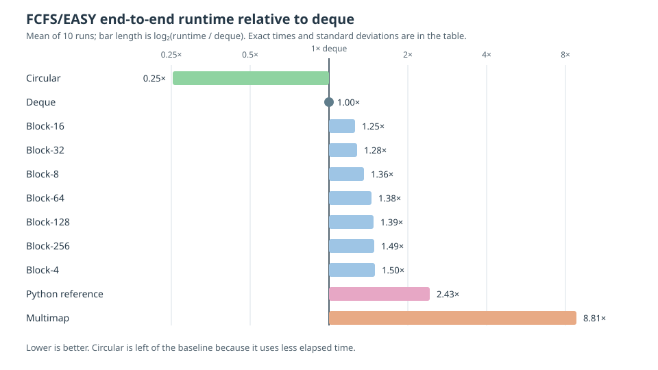

# Wait Queues

The FCFS scheduler can use circular, deque, multimap, or block-based wait
queues. The default is circular. This section collects the implementation
guides, testing instructions, and the evidence behind that default in one
place.

## Default queue and selection

Use the default circular queue for FCFS workloads unless a workload-specific
benchmark says otherwise:

```bash
${CMAKE_INSTALL_PREFIX}/bin/simulator trace.csv --priority_policy fcfs
```

Deque remains the simplest fallback. Block and multimap queues remain available
for comparison, testing, and research.

## Benchmark record

This record was collected in September 2026 using
`tests/test_traces/scale/huge_10000jobs.csv` (10,001 jobs), 500 nodes, and
FCFS with EASY backfilling on an Intel Sapphire Rapids node (112 cores,
256 GB memory). Values are the mean of 10 end-to-end runs; `±` is the
population standard deviation.

The timing includes trace parsing, scheduling and backfilling, event handling,
and trace output. It is not an isolated wait-queue microbenchmark. The queue
implementation is the intended variable, but the complete difference cannot be
attributed solely to queue operations.



| Implementation | Time (s) | Relative to deque |
| --- | ---: | --- |
| Deque | 3.160 ± 0.083 | baseline |
| Multimap | 27.840 ± 0.024 | 781% slower (8.81×) |
| **Circular** | **0.805 ± 0.006** | **75% less elapsed time (3.93× speedup)** |
| Block-4 | 4.741 ± 0.004 | 50% slower (1.50×) |
| Block-8 | 4.288 ± 0.004 | 36% slower (1.36×) |
| Block-16 | 3.961 ± 0.003 | 25% slower (1.25×) |
| Block-32 | 4.056 ± 0.005 | 28% slower (1.28×) |
| Block-64 | 4.354 ± 0.002 | 38% slower (1.38×) |
| Block-128 | 4.388 ± 0.007 | 39% slower (1.39×) |
| Block-256 | 4.716 ± 0.006 | 49% slower (1.49×) |
| Python reference | 7.675 ± 0.052 | 143% slower (2.43×) |

The 10 runs produced identical simulated-job output across every measured C++
queue variant, including multimap. The Python reference is an end-to-end
baseline, but is not byte-compared with C++ because it emits a different CSV
schema.

Run the benchmark with:

```bash
tests/benchmark_block_sizes.sh
```

The script tests deque, multimap, circular, every supported block size, and
the Python reference. It compares the C++ queue outputs with deque for
correctness.

## Queue guides

```{toctree}
:maxdepth: 2

design-decisions/CIRCULAR_QUEUE
BLOCK_WAIT_QUEUE
OUTPUT_TRACE_BUFFERS
```
