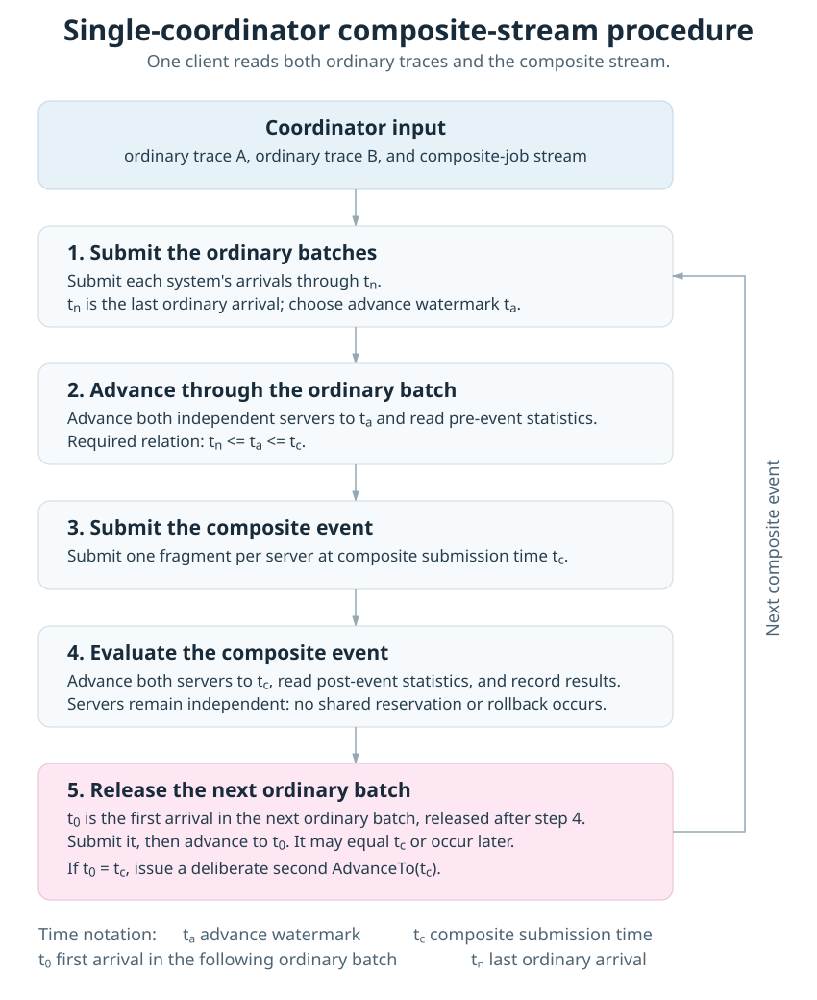

# Client/Server Use Cases

This page describes ways to deploy DR_EVT clients and servers. The underlying
transport is gRPC, but the important boundary is the client/server session:
the client supplies arrivals and controls simulated time; a server owns one
independent simulation per session. For installation and the streaming
request sequence, see [Client/Server Setup](grpc-setup.md).

## Recommended deployment models

Run `dr_evt_server` directly under your normal process supervisor on bare
metal, or run it as a container and expose its gRPC port. In either case,
clients connect to the server address and read their workload data themselves;
the server needs only a writable directory for its result files. The
[container setup](https://github.com/LLNL/dr_evt/blob/main/containers/docker/README.md) includes a server result
mount and an interactive client with a host input-data mount.

MPI is not required for, or a primary deployment mechanism of, the gRPC
client/server service. The optional MPI launcher below is a convenience for
test and experiment orchestration.

## One client, multiple servers

This example uses one controller with a separate session to each server. It
works well for independent sites or queues, and for digital twins that route
live arrivals to the appropriate simulation. It is only one topology: clients
and servers may both be scaled independently. Scheduler state and nodes are
not shared between sessions.

:::{figure} ../_static/client-server-architecture.png
:alt: Workload sources feed client processes and digital-twin controllers, which open independent gRPC sessions to server processes. Each session has an isolated simulation, scheduler state, and nodes.
:width: 100%
:::

`python/grpc_multi_server.py` demonstrates this arrangement. It reads the
sample CSV on the client, partitions rows among repeated `--server` options,
and prints one statistics row per server. The CSV is only a convenient source
of example arrivals: servers do not load it and require no prior knowledge of
the workload.

```bash
python3 -m pip install grpcio grpcio-tools protobuf
python3 python/grpc_multi_server.py \
  --jobs /shared/jobs.csv \
  --session-name twin-west \
  --server server-a:50051 \
  --server server-b:50051
```

Round-robin is the default partitioning and preserves submit-time ordering
within each server's partition. Use `--distribution contiguous` to give each
server a contiguous range instead.

## Optional: MPI test and experiment launcher

`python/grpc_mpi_launcher.py` starts one client on rank 0 and one server on
each remaining MPI rank. It discovers server addresses through MPI, passes
them to the root client, and stops the servers when the client finishes. It is
useful for test orchestration or controlled experiments; production deployments
normally start independent bare-metal processes or containers instead.

```bash
python3 -m pip install mpi4py grpcio grpcio-tools protobuf
mpirun -np 4 python3 python/grpc_mpi_launcher.py \
  --server-binary /path/to/dr_evt_server --base-port 50051 -- \
  --jobs /shared/jobs.csv --total-nodes 1000
```

This launch starts three independent servers on ports `50051` through `50053`.
The rank count is one client plus the number of servers. MPI determines
placement and endpoint discovery; it does not share scheduler state. The root
client reads the example job file and streams the arrivals, so server ranks do
not need access to that file.

Use your MPI launcher's host or hostfile options to distribute ranks across
nodes. Ranks must resolve one another's hostnames, selected TCP ports must be
reachable, and the server binary must be available on every server node.

### Test-only Slurm validation

From an allocation that permits `srun`, first build the server and install the
Python/MPI dependencies:

```bash
cmake -S . -B build -DDR_EVT_ENABLE_PROTOBUF=ON -DDR_EVT_ENABLE_GRPC=ON
cmake --build build --target dr_evt_server-bin
python3 -m venv .venv-grpc
.venv-grpc/bin/python -m pip install mpi4py grpcio grpcio-tools protobuf
```

Then run one client rank and one server rank on a single allocated node:

```bash
srun -N 1 -n 2 .venv-grpc/bin/python python/grpc_mpi_launcher.py \
  --server-binary ./build/dr_evt_server --base-port 50151 -- \
  --jobs tests/test_traces/grpc/trace_a.csv --total-nodes 100
```

For multiple nodes, request enough nodes and choose `-n` as one client plus
the requested servers--for example, `srun -N 2 -n 3` for one client and two
servers. The job path needs to be accessible only to the client rank. This is
an MPI testing workflow, not a required runtime architecture.

## Synchronized independent systems

`python/grpc_sync_coordinator.py` is a small experiment controller for
multiple independent schedulers. It reads one ordinary-job trace per system
and a long-form composite-job trace, streams ordinary jobs to their servers,
advances all servers to each composite event time, then submits the composite
fragments concurrently.

The coordinator is the only client that reads all three input streams. It owns
the timing decision; the servers own only their independent scheduler state.
For one system, let `tn` be the last arrival in the ordinary batch before a
composite event, `ta` the coordinator's advance watermark, `tc` the composite
event time, and `t0` the first arrival in the following ordinary batch. The
pre-composite batch must satisfy `tn <= ta <= tc`. This covers both an
equal-time event (`tn = ta = tc`) and a strict-boundary event
(`tn <= ta < tc`).

The `t0`, `t1`, ..., `tn` notation names ordinary-job arrival timestamps in
arrival order; the subscripts are indices, not simulation-time values. Thus
`tn` denotes the final ordinary arrival before the composite boundary, `t0`
denotes the first one after it, and any `t1` through `t(n-1)` are intervening
ordinary arrivals in their respective batches.

For each composite event, the coordinator does the following in order:

1. Append and submit each system's ordinary arrivals through `tn`.
2. Advance every server to the common watermark `ta`, then read pre-event
   statistics.
3. Append and submit one composite fragment to each server at `tc`.
4. Advance every server to `tc`, then read post-event statistics and record
   immediate, delayed, or partial starts.
5. Only after that evaluation, append the next ordinary batch. Its first
   arrival may be at `t0 = tc` or at a later time.
6. Advance again to `t0` so the newly queued ordinary arrivals are evaluated.
   When `t0 = tc`, this is deliberately a second `AdvanceTo(tc)` call.

This observes independent schedules; it makes no cross-server reservation or
rollback guarantee.



### Timing exercised by the single-coordinator fixture

`tests/test_grpc_single_coordinator.py` is a one-client, two-server integration
test. The coordinator reads both ordinary traces and the composite stream; the
two ordinary streams use synchronized timestamps and differ only in requested
node counts. For each server, it also builds an independent seven-arrival
baseline with `simulator` and byte-compares the gRPC session's simulated-job
and resource traces with that baseline. This verifies scheduling and resource
accounting, not only the final job counts.

| Test case | Step | Server 1 timing | Server 2 timing | Composite timing | Relation exercised |
| --- | --- | --- | --- | --- | --- |
| 1 | Initial ordinary batch | `tn_s1 = 10` | `tn_s2 = 10` | `ta = tc = 10` | `tn_s1 = tn_s2 = ta = tc` |
| 2 | Equal-time next batch | `t0_s1 = 10` | `t0_s2 = 10` | Previous `tc = 10` | `t0_s1 = t0_s2 = tc`; a second `AdvanceTo(tc)` evaluates it |
| 3 | Later ordinary arrival and strict-boundary event | `tn_s1 = ta_s1 = 20` | `tn_s2 = ta_s2 = 20` | `tc = 25` | `tn = ta < tc` |
| 4 | Final ordinary batch | `t0_s1 = 30` | `t0_s2 = 30` | Previous `tc = 25` | `tc < t0_s1` and `tc < t0_s2` |

In short, the fixture guarantees these ordering cases:

1. `tn = ta = tc` for the initial batch.
2. `t0 = tc` after composite evaluation, followed by a second
   `AdvanceTo(tc)`.
3. `tn = ta < tc` for the strict-boundary composite event.
4. `tc < t0` for the later ordinary batch.

Thus the fixture covers the equal-time and strict forms of the per-system
boundaries above. It does not yet cover the interior timing case
`tn < ta < tc`, or every distributed timing permutation: both systems use the
same timestamps, so a staggered case such as `tn_s1 < tc < t0_s2` is not
exercised.

```bash
# Start one server for each address in systems.csv.
./build/dr_evt_server 127.0.0.1:50061
./build/dr_evt_server 127.0.0.1:50062

.venv-grpc/bin/python python/grpc_sync_coordinator.py \
  --systems python/examples/sync_systems.csv \
  --composites python/examples/composite_jobs.csv \
  --output composite-results.jsonl
```

`systems.csv` contains `system_id,address,trace` and optional `total_nodes`.
Its trace is a controller-side arrival source, not a server-side workload.
`composite_jobs.csv` contains one fragment per row with
`composite_id,submit_time,system_id,num_nodes,queue,time_limit`; a composite
ID must name at least two systems.

The coordinator initially sends each system's ordinary trace with
`AppendJobs`; their original submit times remain attached to the jobs. For a
composite event at `tc`, an ordinary batch may end at `tn <= tc` and the
coordinator may first call `AdvanceTo(ta)`, where `ta <= tc`. Each fragment is
then appended with `submit_time=tc` and submitted, followed by
`AdvanceTo(tc)`, which evaluates the newly arrived same-time work. The bundled
coordinator selects `ta = tc`; a smaller `ta` is useful when deliberately
testing a strict boundary before the composite event.
`AppendJob` is used for the one-fragment-per-system example; `AppendJobs` can
submit a chronologically ordered batch when a system has multiple arrivals. In
an incremental stream, the following ordinary batch begins at `t0`, with
`tc < t0`; the bundled example instead pre-submits its complete ordinary trace
at initialization.

The JSON Lines output records node counts before and after each fragment, and
marks `partial_start` when only some fragments appear to start immediately.
It is observational: the coordinator does not reserve, cancel, or roll back
work on any server.
